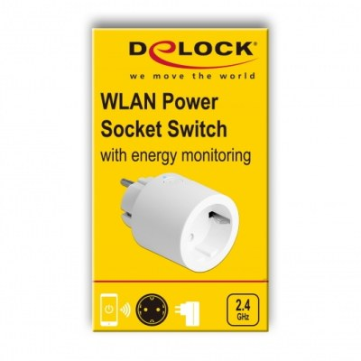

1. TOC
{:toc}

## General Notes

Model reference: 11827

Manufacturer: [Delock](https://www.delock.de/produkte/G_11827/merkmale.html)

The device comes **pre-flashed with Tasmota**.
Flashing ESPHome is easily possible by uploading an ESPHome .bin file using the device's web interface.



## GPIO Pinout

| Pin    | Function |
|--------|----------------------------|
| GPIO3  | Button (inverted)          |
| GPIO4  | HLW8012 - CF               |
| GPIO5  | HLW8012 - CF1              |
| GPIO12 | HLW8012 - SEL              |
| GPIO13 | LED                        |
| GPIO14 | Relay                      |

## HLW8012 Calibration Values

| Value   |           |
|---------|-----------|
| Current | 0.0009356 |
| Voltage | 2182      |

Values vary between devices, should be calibrated.

## Basic Config

Basic configuration with switch and power/voltage/current reporting.

```yaml
substitutions:
  plug_name: delock01
  # Higher value gives lower watt readout. Calibrate for higher accuracy.
  current_res: '0.0009356'
  # Lower value gives lower voltage readout. Calibrate for higher accuracy.
  voltage_div: '2182'

esphome:
  name: ${plug_name}
  platform: ESP8266
  board: esp8285

wifi:
  ssid: !secret wifissid
  password: !secret wifipw

  
  # Enable fallback hotspot (captive portal) in case wifi connection fails
  ap:
    ssid: "${plug_name} Fallback Hotspot"
    password: "7xlV0YQ3J35a"

captive_portal:

# Enable logging
logger:

# Enable Home Assistant API
api:
  password: !secret esphome_api_pw

ota:
  password: !secret esphome_ota_pw

# Example configuration entry
web_server:
  port: 80

# Example configuration entry
sensor:
  - platform: hlw8012
    sel_pin:
      number: GPIO12
      inverted: true
    cf_pin: GPIO04
    cf1_pin: GPIO05
    current:
      name: "${plug_name} Current"
      unit_of_measurement: A
      accuracy_decimals: 3
    voltage:
      name: "${plug_name} Voltage"
      unit_of_measurement: V
      accuracy_decimals: 1
    power:
      name: "${plug_name} Power"
      unit_of_measurement: W
      accuracy_decimals: 0
    voltage_divider: ${voltage_div}
    current_resistor: ${current_res}
    change_mode_every: 3
    update_interval: 3s

binary_sensor:
  - platform: gpio
    pin:
      number: GPIO3
      inverted: True
    name: "${plug_name} Button"
    on_press:
      - switch.toggle: relay

switch:
  - platform: gpio
    id: led
    pin: GPIO13

  - platform: gpio
    name: "${plug_name} Smart Plug"
    pin: GPIO14
    id: relay
    on_turn_on:
      - switch.turn_on: led
    on_turn_off:
      - switch.turn_off: led
```
